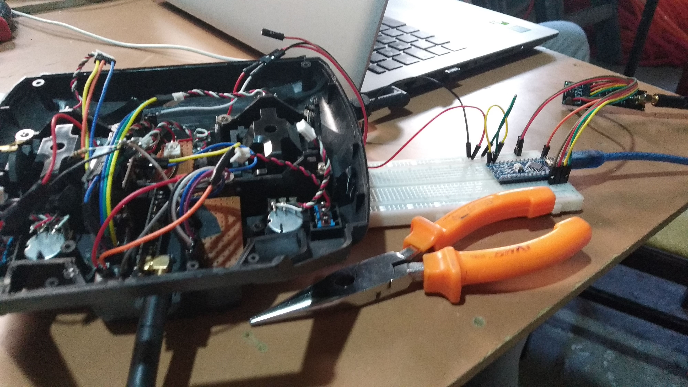

# RC-Airplane-Communication

Receiver and transmitter codes for a RC airplane.

I used two arduino nano and two NRF24 module inserted in both airplane and remote controller. Communication worked pretty well but lack of experience [crashed the airplane](https://youtu.be/BTtzqg-JXrY) in the end.

#### Controller communication tests with an inserted Arduino Nano

